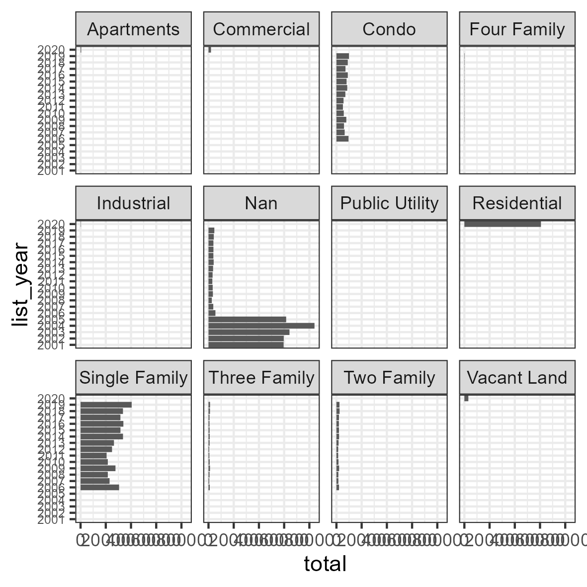

By the following chart shows that the year 2020 began the categorization between
commercial, residential and other types.

Before the year 2020 only residential real state received a proper category, the commercial and
other types are probably marked as Nan.

Maybe the Nan values should analyze separately.

Even after treatment before 2006 the real state were not properly categorized
The strategy adopted here is to separate the analysis, in other to see the effect
of the residential the dataset will be splitted into two parts before the year 2006
and after the year 2006.

The charts of the residential type proportion allow us to determine that Na Values 
can skew the data, even though they appear the second most present value the majority
of them are present before the category was created.
The line plot shows that the proportion between residential types do not vary that much
as time goes on.