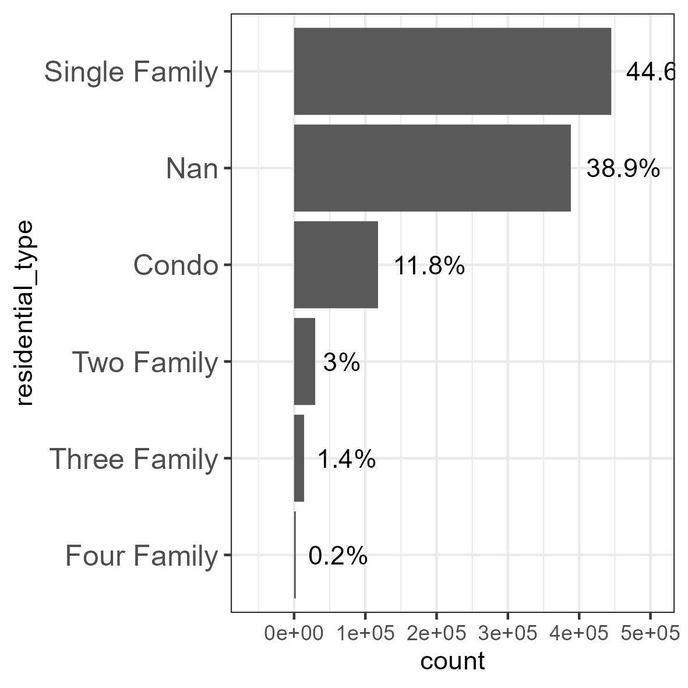

The following chart illustrates the categorization of properties into commercial, residential, and other types, beginning in the year 2020.

Before 2020, only residential real estate received a proper category, while commercial and other types were likely marked as NaN (Not a Number).

It is important to note that NaN values should be analyzed separately, as depicted in the chart below, which illustrates the data after treatment.

Even after treatment, it is evident that before 2006, real estate was not properly categorized. The adopted strategy involves separating the analysis into two parts: before and after 2006.

To assess the impact of residential properties, the dataset is split into two periods: before and after 2006.

The charts depicting the proportion of residential types highlight how NaN values skew the data. While NaN values appear as the second most prevalent category, the majority of them were recorded before the residential category was created. The line plot indicates that the proportion of residential types does not vary significantly over time.

